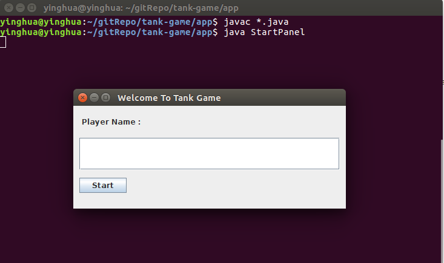
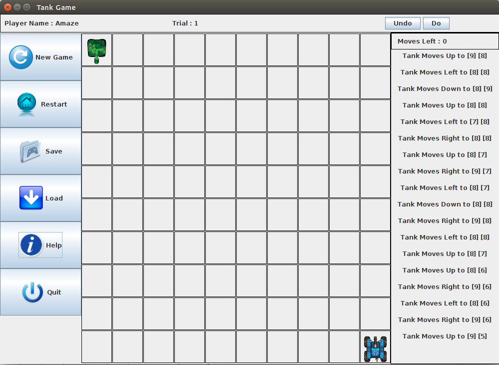

Tank Game 
=========
> Single player game build with Java **object-oriented concepts, multi-threading, design patterns and MVC pattern**. Allow player to destroy enemy by shooting, save, load and replay the game. 

***

Table Of Contents 
=================

* [Tank Game](#tank-game)
* [Table Of Contents](#table-of-contents)
* [Getting Started](#getting-started)
  * [Documentation](#documentation)
  * [Infrastructure Setup and Installation](#infrastructure-setup-and-installation)
* [Highlights](#highlights)
  * [Software Resources](#software-resources)
  * [Features](#features)
  * [Screenshot](#screenshot)
* [About](#about)
  * [Contributor](#contributor)
  * [Status](#status)
  
***

Getting Started
===============
Documentation
-------------
The documentation contains:- 
1. Guides to compile and run the game
2. Guides to user the program and play the games
3. UML Diagram  
   &nbsp; &nbsp; &nbsp; &nbsp; &nbsp; &nbsp; 3.1 Use Case Diagram   
   &nbsp; &nbsp; &nbsp; &nbsp; &nbsp; &nbsp; 3.2 Sequence Diagram  
   &nbsp; &nbsp; &nbsp; &nbsp; &nbsp; &nbsp; 3.3 Class Diagram  
4. Explaination and description of design pattern used in this project  

Download the document **[HERE](https://github.com/CodesAreHonest/tank-game/blob/master/doc/tank-game-documentation.pdf).**

Infrastructure Setup and Installation
-------------------------------------
1. Clone the sourcecode with Git:
```sh 
$ git clone https://github.com/CodesAreHonest/tank-game.git
```
2. Open the clone repository, change directory to app folder.
```sh
$ cd app 
``` 
3. Compile all the Java sourcecode.
```sh 
$ javac *.java 
```
4. Execute the Java main class. 
```sh
$ java StartPanel
```
<p align="center"></p>  

***  

Highlights
==========
Software Resources
------------------
1. Linux Ubuntu 16.04.3 LTS 64-bit  
2. Sublime Text 3  
3. Java(TM) SE Runtime Environment (build 1.8.0_151-b12)

Features
--------
A tank game that allow player to challenge the bot by input sequences of move, player are require to predict the location of enemy tank and destroy it. 

The key feature of tank game are as follow:- 
1. Load and Save games with player name.  
2. Play the games with keyboard and mouse.  
3. Restart the game level.   
4. Re-challenge the game.   
5. Guide to play the game.  

Screenshot
----------
The image below is the screenshot of tank game.  
<p align="center"></p> 

***  

About
=====
Contributor
-----------
- **Chai Ying Hua**   

Status
------
This project had stop maintaining and delivered. Any pull request or improvement are welcomed. 


